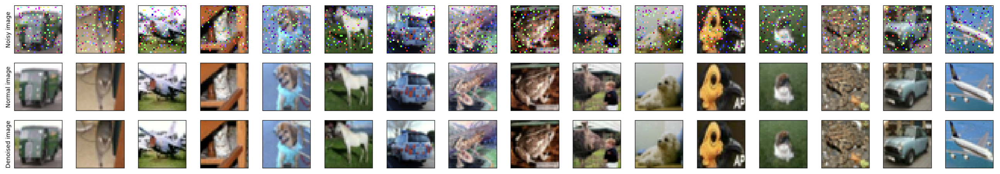

# CIFAR10 Denoising Using U-NET
This project implements convolutional neural networks and Unet on cifar10 dataset. It includes four parts, where the accuracy is increased through various techniques, and attention mechanisms are used to enhance the Unet network.
I implemented a U-Net architecture with attention mechanisms for denoising images in the CIFAR-10 dataset. The goal was to improve the Peak Signal-to-Noise Ratio (PSNR) of the denoised images by utilizing attention mechanisms.

# Dataset
The CIFAR-10 dataset is a widely used benchmark dataset in computer vision and machine learning research, consisting of 60,000 32x32 color images in 10 classes. The dataset can be loaded and preprocessed using the torchvision.dataset.CIFAR10 module in PyTorch. It is typically split into three parts for training, validation, and testing of models for image classification tasks. The CIFAR-10 dataset is a valuable resource for researchers and practitioners in the field, providing a standardized and diverse set of images for experimentation and evaluation.

# Preprocessing
Preprocessing is a crucial step in machine learning tasks, as it significantly affects the performance of the model. Preprocessing for the CIFAR-10 dataset involves normalization, data splitting, and loading the dataset using the torchvision.dataset.CIFAR10 module. Normalization scales the pixel values to have zero mean and unit variance, which improves model convergence and performance. Data splitting divides the dataset into training, validation, and test sets for model training and evaluation. By following these preprocessing steps, we can improve the quality of the input data and prepare the CIFAR-10 dataset for image classification tasks.

# Unet Neural Network for Image Denoising in CIFAR-10
This project implements a Unet neural network for removing noise from images in the CIFAR-10 dataset. The Unet model is trained on preprocessed data using PyTorch, and the results and accuracies obtained in the training, validation, and test stages are reported and visualized. This project demonstrates the effectiveness of the Unet architecture for image denoising in CIFAR-10, providing a valuable resource for researchers and practitioners in the field of computer vision and machine learning.

# UNet With Attention Neural Network for Image Denoising
This code defines a UNetWithAttention neural network model for image denoising, which improves accuracy by using attention blocks. The model is trained on preprocessed data using PyTorch and the results and accuracies are reported and visualized for the training, validation, and test stages. Overall, the UNetWithAttention architecture is effective for image denoising tasks in the CIFAR-10 dataset.

# Result

